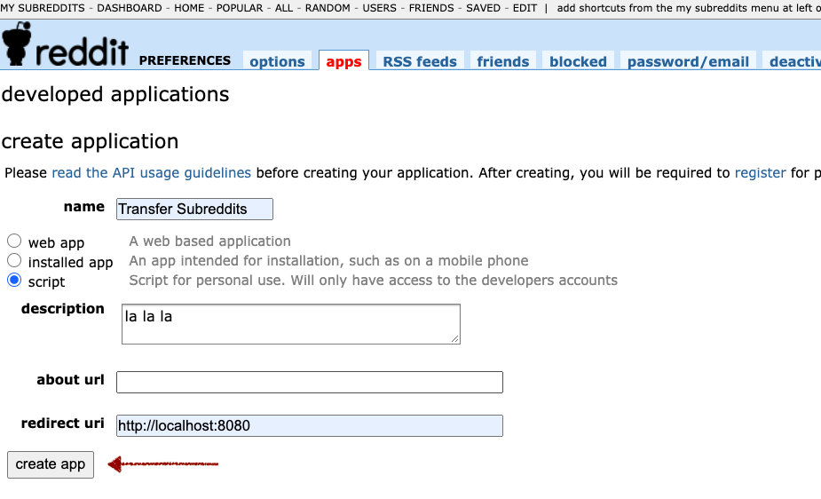
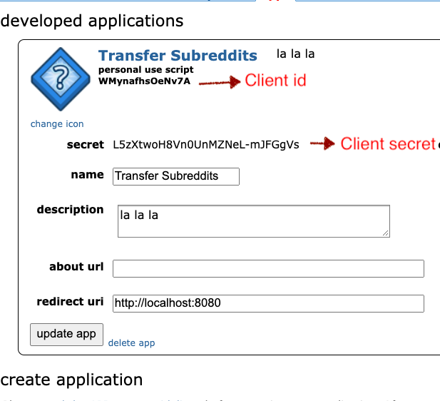
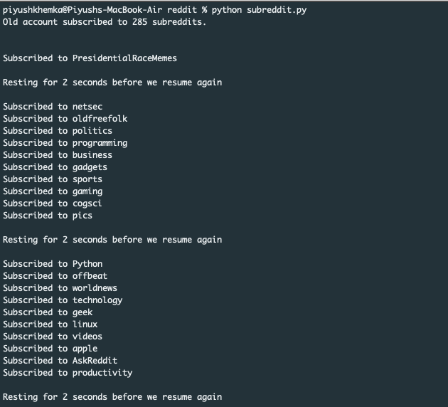

## Subreddit Migrator

Reddit doesn't make it easy for you to migrate your subreddits from one account to the other but there is a workaround.

Follow the following steps to make your new account subscribe to all the subreddits that your old account was subscribed to.


1. Login to your old account. Visit https://www.reddit.com/prefs/apps


2. Create an application.
 - Type of application - script
 - You can put the redirect url as http://localhost:8080
 - Rest of the things like description don't matter. Put anything there



3. Once the application is created, copy the client id & secret id.



4. Copy client_id & client_secret code into old_user_config.json
5. Put down your username & password in username & password section. Don't worry, the code always stay on your local machine. It is only used to authenticate your account.
6. Repeat steps 1 to 5 with your new account. Copy the client_id & client_secret code into new_user_config.json. Add your username & password of the new account there as well.
7. Run the file subreddit.py. CD into the folder containing the file & run the command -

```
python subreddit.py
```
8. All your subreddits should be copied from old account to new account.


